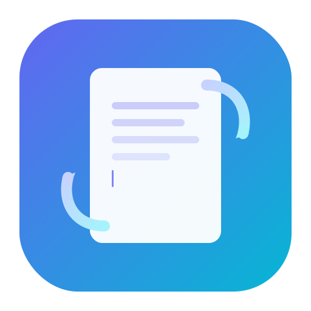

<p align="center">
  
</p>

<h1 align="center">SyncPad</h1>

<p align="center">
  <strong>Real-time Collaborative Document Editor</strong><br/>
  Multiple users edit the same document simultaneously — changes sync instantly via WebSockets.
</p>

<p align="center">
  
  
  
  
  
  
</p>

---

## ✨ Features

| Feature | Description |
|---|---|
| 🔐 **JWT Authentication** | Secure signup/login with bcrypt password hashing |
| 📝 **Document Management** | Create, list, and join documents by ID |
| ⚡ **Real-time Collaboration** | Live text sync via Socket.io — changes broadcast instantly to all editors |
| 👥 **Active User Presence** | See who's currently editing with colored avatars |
| 💾 **Auto-save** | Debounced save every 2 seconds of inactivity |
| 🕑 **Version History** | Browse and revert to any previously saved snapshot |
| 🎨 **Premium Dark UI** | Glassmorphism design with gradient accents and micro-animations |

---

## 🏗️ Architecture

```
┌────────────────────────┐        ┌────────────────────────────┐
│   React Frontend       │  REST  │   Express Backend          │
│   (Vite + Tailwind)    │◄──────►│   /api/auth                │
│                        │        │   /api/documents           │
│   Socket.io-client     │◄──────►│   Socket.io Server         │
└────────────────────────┘  WS    └──────────┬─────────────────┘
                                             │
                                    ┌────────▼────────┐
                                    │  MongoDB Atlas   │
                                    │  (Users, Docs,   │
                                    │   Versions)      │
                                    └─────────────────┘
```

---

## 📁 Project Structure

```
SyncPad/
├── server/                     # Backend
│   ├── config/db.js            # MongoDB connection
│   ├── controllers/
│   │   ├── authController.js   # Signup, login, getMe
│   │   └── documentController.js # CRUD, join, versions, revert
│   ├── middleware/auth.js      # JWT verification middleware
│   ├── models/
│   │   ├── User.js             # name, email, password (hashed)
│   │   ├── Document.js         # title, content, owner, collaborators
│   │   └── Version.js          # content snapshots for history
│   ├── routes/
│   │   ├── authRoutes.js
│   │   └── documentRoutes.js
│   ├── sockets/
│   │   └── documentSocket.js   # Real-time sync + active users
│   ├── .env                    # Environment variables
│   ├── index.js                # Entry point
│   └── package.json
│
├── client/                     # Frontend
│   ├── public/logo.svg         # SyncPad logo
│   ├── src/
│   │   ├── components/
│   │   │   ├── ActiveUsers.jsx
│   │   │   ├── Navbar.jsx
│   │   │   ├── ProtectedRoute.jsx
│   │   │   └── VersionHistory.jsx
│   │   ├── context/
│   │   │   └── AuthContext.jsx
│   │   ├── hooks/
│   │   │   └── useSocket.js    # Socket.io connection hook
│   │   ├── pages/
│   │   │   ├── Login.jsx
│   │   │   ├── Register.jsx
│   │   │   ├── Dashboard.jsx
│   │   │   └── Editor.jsx
│   │   ├── services/
│   │   │   ├── api.js          # Axios instance + JWT interceptor
│   │   │   ├── authService.js
│   │   │   └── documentService.js
│   │   ├── App.jsx
│   │   └── index.css           # Tailwind + custom design system
│   ├── index.html
│   ├── tailwind.config.js
│   ├── postcss.config.js
│   ├── vite.config.js
│   └── package.json
│
└── README.md
```

---

## 🚀 Getting Started

### Prerequisites

- **Node.js** v18+
- **MongoDB Atlas** account (free tier works)

### 1. Clone the repository

```bash
git clone <your-repo-url>
cd SyncPad
```

### 2. Configure environment variables

Edit `server/.env`:

```env
PORT=5000
MONGO_URI=mongodb+srv://<user>:<password>@cluster0.xxxxx.mongodb.net/syncpad?retryWrites=true&w=majority
JWT_SECRET=replace_with_a_strong_random_secret
```

### 3. Start the backend

```bash
cd server
npm install
npm run dev
```

You should see:
```
🚀 Server running on http://localhost:5000
✅ MongoDB connected: cluster0-shard-xxxxx.mongodb.net
```

### 4. Start the frontend

```bash
cd client
npm install
npm run dev
```

Open **http://localhost:5173** in your browser.

---

## 🔌 API Reference

### Auth

| Method | Endpoint | Auth | Description |
|--------|----------|------|-------------|
| POST | `/api/auth/signup` | ✗ | Register a new user |
| POST | `/api/auth/login` | ✗ | Login and receive JWT |
| GET | `/api/auth/me` | ✓ | Get current user info |

### Documents

| Method | Endpoint | Auth | Description |
|--------|----------|------|-------------|
| POST | `/api/documents` | ✓ | Create a new document |
| GET | `/api/documents` | ✓ | List user's documents |
| GET | `/api/documents/:id` | ✓ | Get document by ID |
| POST | `/api/documents/:id/join` | ✓ | Join as collaborator |
| GET | `/api/documents/:id/versions` | ✓ | Get version history |
| POST | `/api/documents/:id/revert/:versionId` | ✓ | Revert to a version |

### WebSocket Events

| Event | Direction | Payload | Description |
|-------|-----------|---------|-------------|
| `join-document` | Client → Server | `documentId` | Join a document room |
| `load-document` | Server → Client | `content` | Initial document content |
| `send-changes` | Client → Server | `content` | Broadcast edits |
| `receive-changes` | Server → Client | `content` | Receive others' edits |
| `save-document` | Client → Server | `{ documentId, content }` | Persist to DB |
| `active-users` | Server → Client | `[{ _id, name }]` | Online users list |

---

## 🧠 How Real-time Sync Works

1. User types → `send-changes` emitted to server.
2. Server uses `socket.to(room)` to broadcast to **everyone except** the sender — this prevents echo loops.
3. Receiving clients update their textarea via a ref-guarded state update (`isRemoteUpdate`), which prevents re-emitting the received change.
4. Auto-save triggers after 2 seconds of inactivity, persisting content and creating a version snapshot.

---

## 🚢 Deployment

### Backend (Render)

- **Build command:** `npm install`
- **Start command:** `node index.js`
- **Environment variables:** `PORT`, `MONGO_URI`, `JWT_SECRET`

### Frontend (Vercel)

- **Build command:** `npm run build`
- **Output directory:** `dist`
- **Environment variable:** `VITE_API_URL` (your deployed backend URL)

> Update `client/src/services/api.js` to use:
> ```js
> const API_BASE_URL = import.meta.env.VITE_API_URL || "http://localhost:5000/api";
> ```

---

## 🛠️ Tech Stack

| Layer | Technology |
|-------|-----------|
| **Frontend** | React 19, Vite 6, Tailwind CSS 3, Axios, Socket.io-client |
| **Backend** | Node.js, Express.js, Socket.io 4 |
| **Database** | MongoDB Atlas + Mongoose |
| **Auth** | JWT + bcryptjs |
| **Dev Tools** | Nodemon, ESLint, PostCSS |

---
